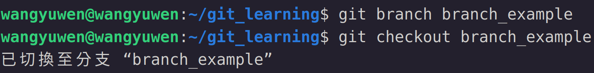
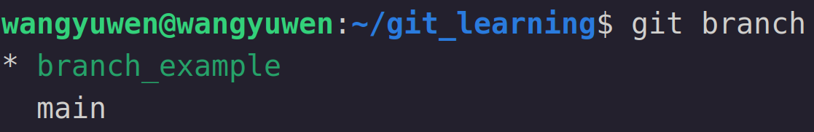
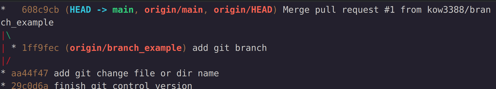

# Git 分支
通常在開發程式時，會有一個穩定版本，這個版本是給客戶使用的，因此並不會希望正在開發還不夠穩定的東西放在上面

這時我們就需要去創建一個分支(branch)，而正在開發的內容就是在這個branch上進行，而通常我們的main (或master) branch則是我們的穩定版本，暫時不會去動到它，等到公司認定這個開發的內容足夠穩定之時，我們就會把它merge進main (master)，在提供給客戶

## git branch
###創建branch以及切換至branch
創建branch的指令相當容易，指令如下
```
git branch branch名稱
```
接著創了一個branch，但實際上我們現在還是在main這個branch上，因此要下 "git checkout" 來切換到我們要的branch上
```
git checkout branch名稱
```
如下圖所示

我們就可以在branch上開發，而不影響到main的內容

當然我們也可以在branch上在新增一個branch，指令如下
```
git branch branch名稱 舊有branch名稱
```

### 查看目前有哪些branch和目前所在的branch
如果直接下 "git branch" 則會顯示有哪些branch，以及目前的所在位置，指令如下
```
git branch
```
顯示結果如下圖

以上圖為例，可以看到我們現在有 "branch_exampe" 以及 "main" 這兩個branch，並且目前位於 "branch_example" 這個branch

### 刪除branch
開發完之後這個branch就沒有用了，因此我們會先將branch的內容merge進main(之後章節會說明)，再將此branch刪除，指令如下
```
git branch -d branch名稱
```
如此一來就可以在不影響main的情況下完成開發

### Push to remote repository
因為開發程式通常不是短時間內可以完成，因此我們通常也會將branch推上remote repository共同協作

需要下以下指令來將branch推到remote repository
```
git push origin branch名稱
```
在remote repository需要merge時則是要去對應的remote repository去merge

通常在遠端merge完後會將結果pull回來更新本地的commit graph，最終結果如下圖

可以看到有一個branch叉出去，最後又合在一起，表示這個branch開發完畢
