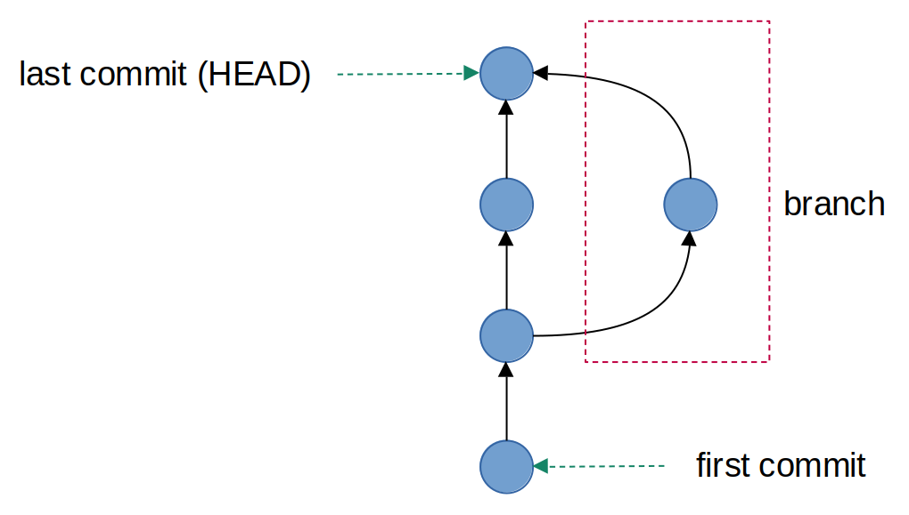
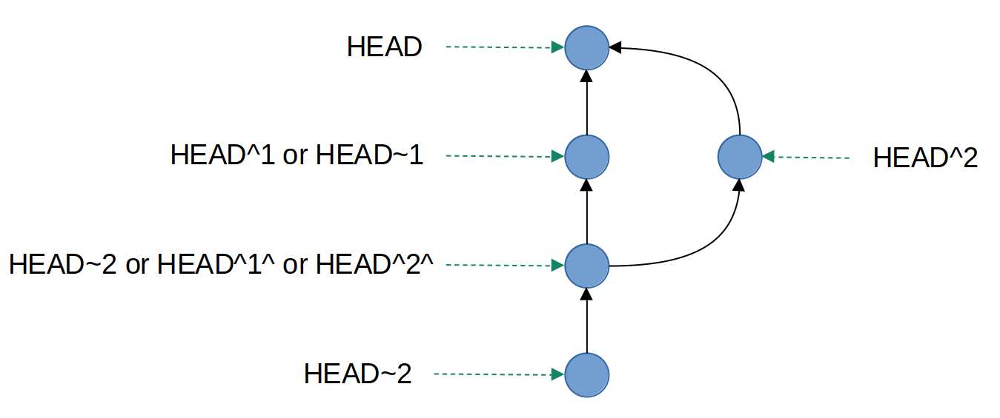
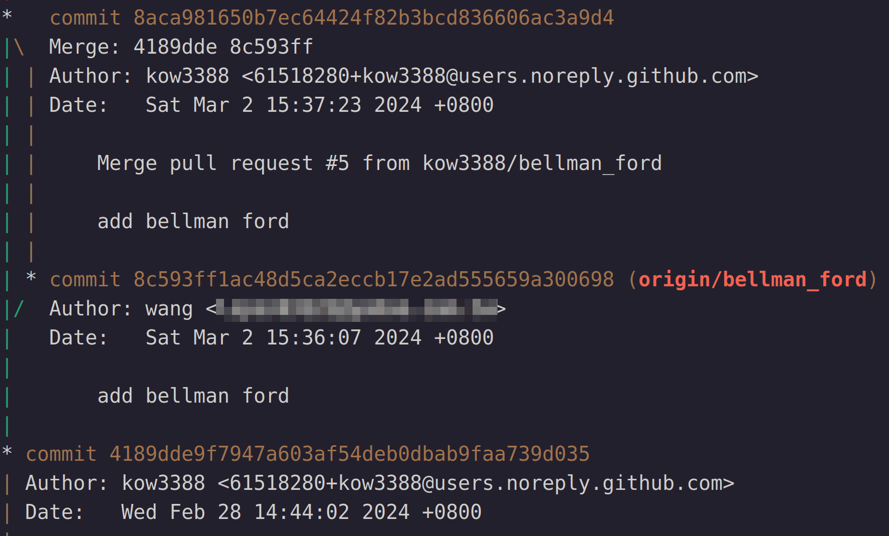
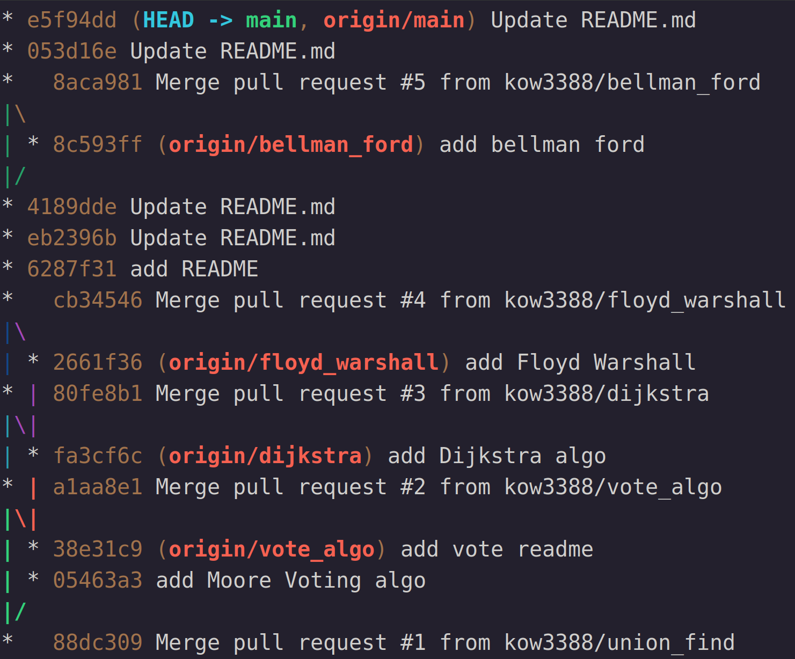

# Git commit
我們要把修改完的檔案加入repository需要兩個步驟，第一步是 "git add" 將檔案放入index中

接著要執行 "git commit" 將檔案提交，推入repository

## Git commit 節點
在"git commit" 會創造一個新的提交節點，這個節點會將當前index中的內容推入repository

### HEAD 指標
git有一個特殊指標HEAD，它會指向目前最新的提交，讓git能夠知道當前的working directory狀態

以圖示來說明
<figure>
	
	<figcaption style="text-align: center;">Fig. 1: commit node</figcaption>
</figure>

上面這張圖每一個節點都是一個commit，最下面的節點是我們第一次的提交(first commit)，最上面的節點是我們最後一次的提交(last commit)

HEAD會指向目前最新的提交也就是last commit，至於紅色虛線框起來的部份是branch，在後面的章節會說明

HEAD會指向最新的提交，我們可以利用HEAD的位置來去查看前面的commit，如下
```
HEAD^數字
HEAD~數字

#範例指令
git show HEAD^1
```
"^數字" 表示那一個父節點(parent)，"~數字"表示第幾層的parent，如下圖所示
<figure>
	
	<figcaption style="text-align: center;">Fig. 2: HEAD parent</figcaption>
</figure>
因為HEAD的一層有branch，所以HEAD有兩個一級的parent，因此有 "HEAD^1" & "HEAD^2"

"^" 是可以疊加的，表示parent的parent

\* 但老實說不常用，通常會直接用hash code或是tag直接定位(後面會說明)

### Git graph
git有指令可以畫出像Fig. 1的圖形
```
git log --graph
```
可以畫出如下圖
<figure>
	
	<figcaption style="text-align: center;">Fig. 3: git log graph</figcaption>
</figure>
但其實 "git log"會顯示出詳細資訊，有時我們不會需要知道所有資訊，只是想看提交的樹圖

這時候我們會加入 "--oneline" 顯示較少資訊
```
git log --oneline --graph
```
結果如下圖所示
<figure>
	
	<figcaption style="text-align: center;">Fig. 4: git log graph oneline</figcaption>
</figure>

這邊可以注意看Fig. 3 & Fig. 4，都會有一串很奇怪的英文+數字組合

這個英文+數字組合是每一個commit的識別碼(hash code，有興趣可以去了解hash code)，這個hash code會是獨一無二，用以代表此節點

(其實不需要打完整的hash code，通常只需要打Fig. 3的前面那幾碼即可)

在上面我們說可以用HEAD來定位其他的commit，也可以用hash code定位
```
hash code^數字
hash code~數字
```

### Git tag
git除了內建的HEAD tag外，也可以自己幫commit上tag，指令如下
```
git tag "自定義tag名稱" commit "hash code or tag"
```
上完tag後就可以像HEAD一樣使用

若想要移除tag可以用下面的指令
```
git tag -d commit "節點tag"
```

## Git commit 指令
上面已經把commit介紹的差不多了，接下來就簡單的提一下指令，如下
```
git commit -m "欲留下的訊息"
```
下git commit指令後即可將index中的內容推上repository
