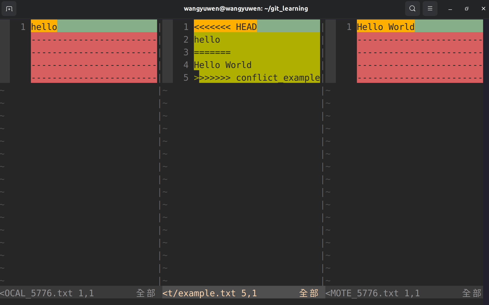

# Git conflict
在前面我們有提到過，在使用no-ff的merge時有可能會遇到conflict的情況，因此這邊要來說明如何解決conflict

## git merge tool setting
在介紹如何解決conflict之前，先來介紹如何，先來介紹如何改變git的merge tool

這邊一樣以vim為例
```
git config --global merge.tool vimdiff
git config --global mergetool.prompt false
git config --global mergetool.vimdiff.trustExitCode true
git config --global mergetool.keepBackup false
```
1. prompt的意思是啟動外部程式時是否詢問 
2. trustExitCode是設定外部程式結束後，git是否直接用他的回傳值來判斷合併是否成功
3. keepBackup是否要備份含有衝突標示的檔案

使用vim來顯示difference


## Solve conflict
其實要解決conflict沒有什麼特別的，就是要手動去解決

以上圖來看，git會告訴以哪裡發生了conflict，git會以7個 "<" 和 ">"來表示發生conflict的範圍

7個 "=" 隔開分別表示兩個branch的的內容

這時我們需要手動的去修改此檔案，把我們要的內容留下來(<, >, = 都需要刪除)，最後存檔，由於我們也設定vim結束之後會判斷合併是否成功，因此存檔完若沒問題就會自動合併

如果在merge時發現有conflict，這時你不確定要怎麼更改檔案(因為很有可能是不同人開發的)，這時可以放棄此次merge，指令如下
```
git merge --abort
```
就會放棄此次merge
