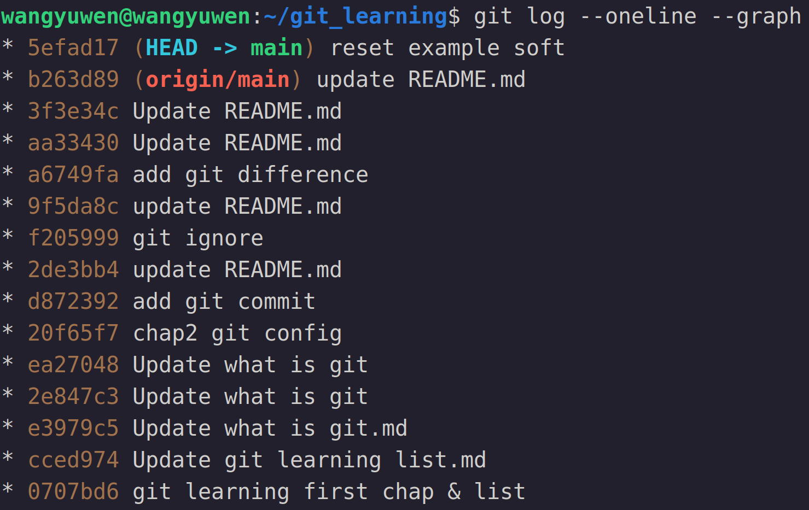
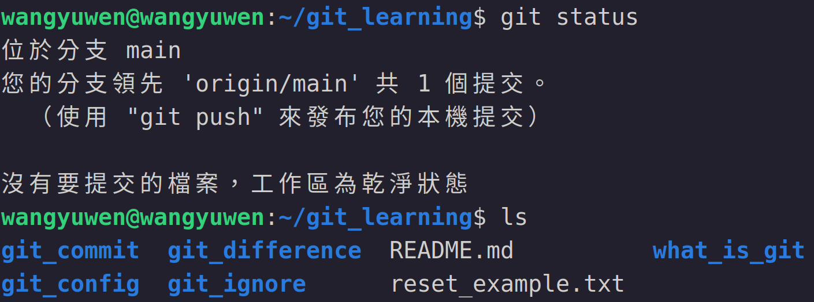
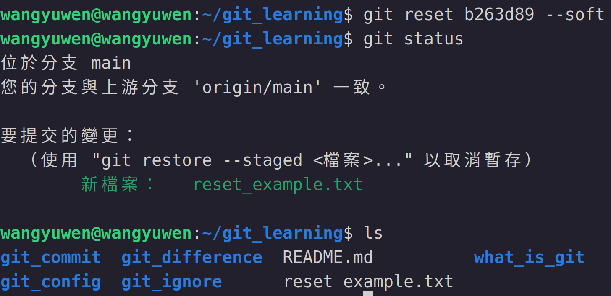
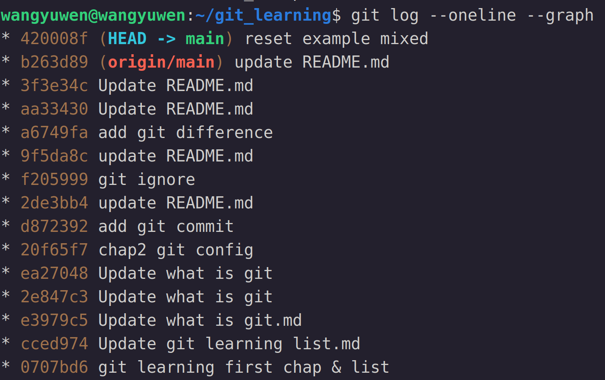
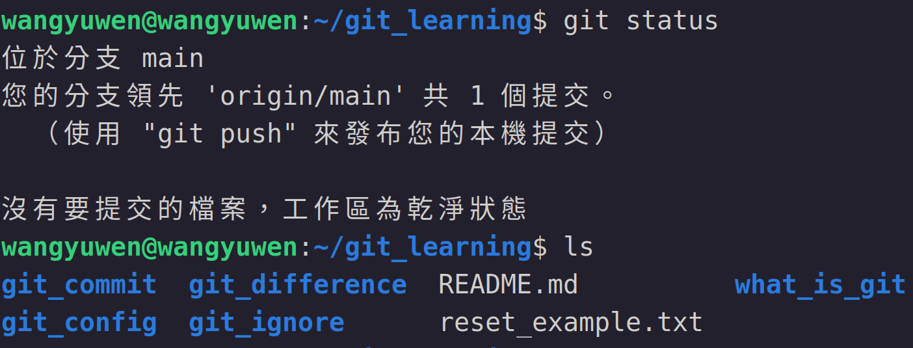
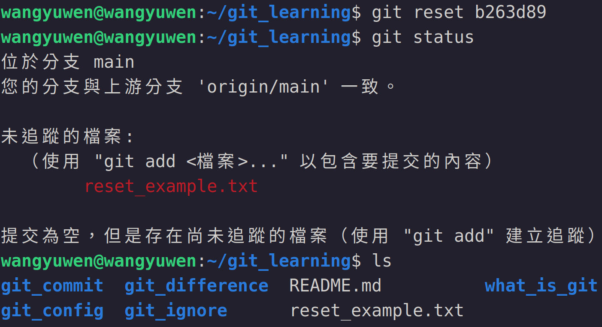
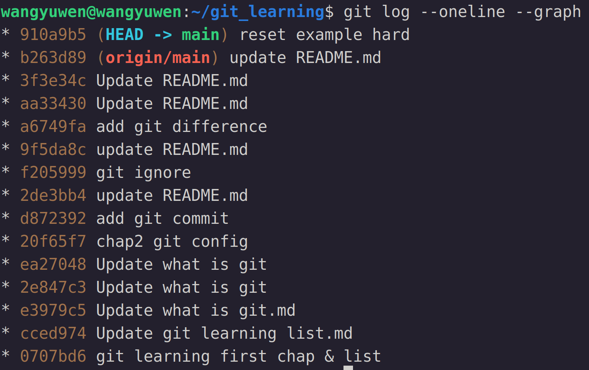
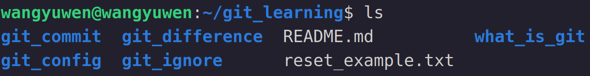
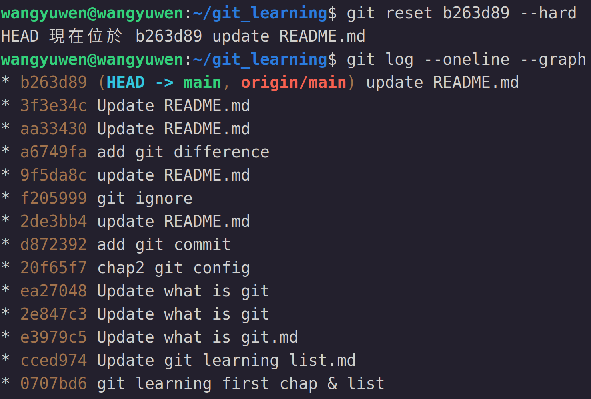
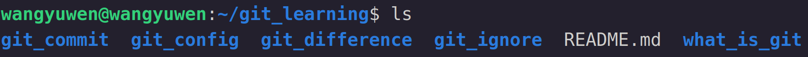

# Git control version
大家常說git是時光機，是因為git可以利用git的commit快照，將檔案恢復到某個特定的commit

主要是透過以下三種git指令來達到回到過去的能力
```
git reset
git revert
git checkout
```

## git reset
先從 "git reset" 開始介紹

"git reset" 是恢復到某一個commit，並把在此commit前的commit刪除

"git reset" 有以下三種模式，其中mixed是預設
```
git reset --soft "commit hash code or tag"
git reset --mixed "commit hash code or tag"
git reset -- hard "commit hash code or tag"
```

### Soft
使用soft表示只有repository恢復到指定commit的狀態，index和working space並未改變

下圖為commit後的commit graph, working space和index狀態 (尚未reset)


reset過後的commit graph, working space和index如下


可以看到最新的commit不見了，但index和working space還保留著檔案

### Mixed (default)
使用mixed表示repository和index恢復到指定commit的狀態，working space並未改變

下圖為commit後的commit graph, working space和index狀態 (尚未reset)


reset過後的commit graph, working space和index如下


和soft進行比較，commit回到相同的狀態，但index和soft不同，檔案並未add入index中，working space一樣保留著檔案

### Hard
使用hard表示全部皆回到指定commit的狀態

下圖為commit後的commit graph, working space和index狀態 (尚未reset)


reset過後的commit graph, working space和index如下


可以看到完全回到最初的狀態，連working space內的檔案都不見了

### Reset on remote repository
"git reset" 是只會在本地端作用，但有時我們已經將結果推上去了，這時我們想要reset，就必須要強置執行 (強制將現在的head推到remote repository)

使用以下指令
```
git push -f origin branch名稱
```
"-f" 的意思是force，將現在的HEAD強行推到remote repository
