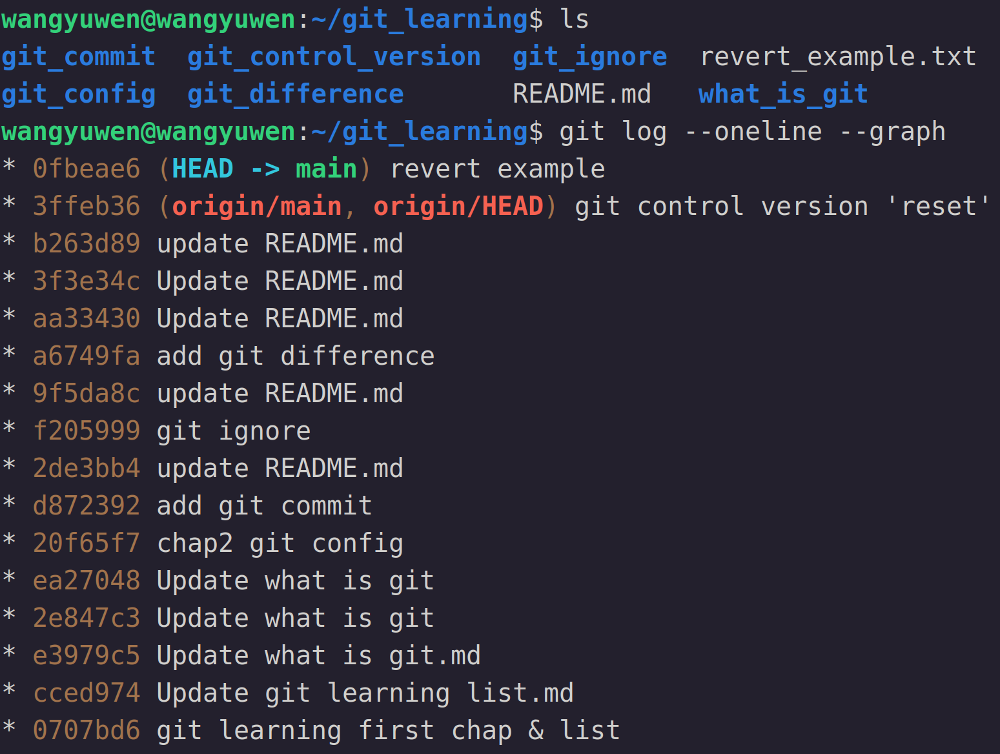

# Git control version
大家常說git是時光機，是因為git可以利用git的commit快照，將檔案恢復到某個特定的commit

主要是透過以下三種git指令來達到回到過去的能力
```
git reset
git revert
git checkout
```

## git reset
先從 "git reset" 開始介紹

"git reset" 是恢復到某一個commit，並把在此commit前的commit刪除

"git reset" 有以下三種模式，其中mixed是預設
```
git reset --soft "commit hash code or tag"
git reset --mixed "commit hash code or tag"
git reset -- hard "commit hash code or tag"
```

### Soft
使用soft表示只有repository恢復到指定commit的狀態，index和working space並未改變

下圖為commit後的commit graph, working space和index狀態 (尚未reset)


reset過後的commit graph, working space和index如下


可以看到最新的commit不見了，但index和working space還保留著檔案

### Mixed (default)
使用mixed表示repository和index恢復到指定commit的狀態，working space並未改變

下圖為commit後的commit graph, working space和index狀態 (尚未reset)


reset過後的commit graph, working space和index如下


和soft進行比較，commit回到相同的狀態，但index和soft不同，檔案並未add入index中，working space一樣保留著檔案

### Hard
使用hard表示全部皆回到指定commit的狀態

下圖為commit後的commit graph, working space和index狀態 (尚未reset)


reset過後的commit graph, working space和index如下


可以看到完全回到最初的狀態，連working space內的檔案都不見了

### Reset on remote repository
"git reset" 是只會在本地端作用，但有時我們已經將結果推上去了，這時我們想要reset，就必須要強置執行 (強制將現在的head推到remote repository)

使用以下指令
```
git push -f origin branch名稱
```
"-f" 的意思是force，將現在的HEAD強行推到remote repository

## git revert
"git revert" 一樣也有回覆到過去的狀態的能力，只是 "git revert" 是比較 "禮貌" 的作法

"git revert" 和 "git reset" 最大的不同是， "git revert" 並不會改寫過去的歷史紀錄(git commit node)，而是將過去的狀態以一個新的commit node推到repository上

如下圖所示
在還沒revert前，working space以及commit tree如下


在執行 "git revert" 後，可以看到有一個新的commit，並且狀態以變回之前的狀態


但在使用 "git revert" 有一點需要特別注意，那就是 "git revert" 是回到commit 節點的***前一個commit狀態***

以上圖為例，假設我們下了下面指令
```
git revert cd5b320
```
那目前的檔案狀態會是 3ffeb36 這個commit的狀態

## git checkout
```
git checkout commit_node 檔案
```
"git checkout" 和上面兩者不同， "git checkout" 是將特定檔案從某一個commit node***覆蓋***掉現在存在working space的相同檔案

如果沒有指定commit node，指令如下
```
git checkout 檔案
```
這樣的話git會先從index開始搜尋是否有該檔案，若有則放入working space，若沒有則從最新的commit開始搜尋

也可搭配 "git grep" 找到檔案內容中有符合字串的檔案，例如
```
git grep '想找的字串' commit_node
```
這樣的話git會把所有符合該字串的檔案全部覆蓋

其實 "git checkout" 還有切換branch的功能，不過這等到branch的部份實在來說明
