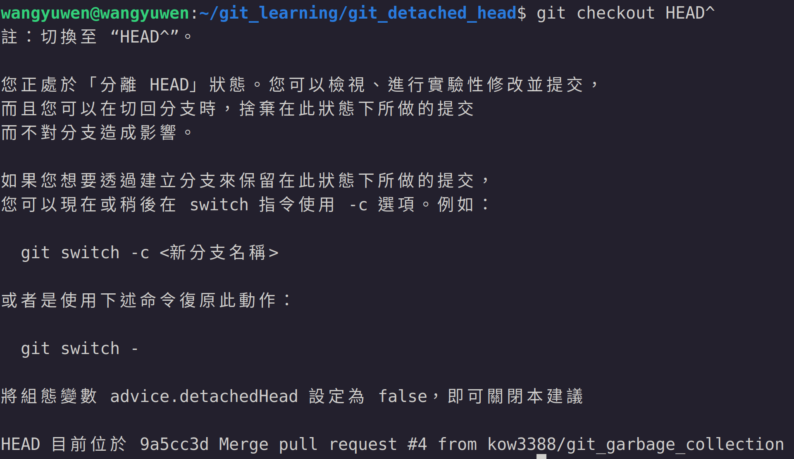

# Git detached head
"Detached head" 就是俗稱的斷頭現象，這邊介紹一下什麼是斷頭

一般來說HEAD會指向一個branch，而branch會指向某一個commit，斷頭是指說HEAD並沒有指到branch的情形，發生斷頭可能有以下原因:
1. 使用checkout跳過某個commit，而此commit沒有branch指向它
2. Rebase的過程其實也是處於不斷的detached head狀態
3. 切換到遠端的某個branch的時候

這邊先給大家看一下目前的log，等一下會故意變成斷頭狀態

執行下面指令後會處於斷頭狀態
```
git checkout HEAD^
```

這時git的實際狀態是處於以下的樣子，有一個無名的branch，且HEAD指到此branch

這個無名的branch只是示意圖，實際上是不存在此branch的，我們可以用以下指令來看git graph的狀態
```
git log --oneline --graph --all --decorate
```

可以看到HEAD是在 "9a5cc3d" 上，但如果我們不加後面的 "\-\-all" 和 "\-\-decorate" ，則會變下面的樣子


## 處理斷頭的方法
處理斷頭有兩種方法
1. 捨棄掉這個無名的branch
2. 把無名branch的內容merge到原來的branch上

### 捨棄無名branch (方法一)
捨棄目前的內容很容易，簡單的說我們先將無名的branch命名，切回main或master，最後再把branch強制刪除即可，指令如下
```
git branch "branch名稱"
git checkout main
git branch -D "branch名稱"
```

### Merge到原來的branch上 (方法二)
要把無名branch內容merge到原來branch上指令上其實和方法一差不多，但需要手動去解決conflict的部份
指令如下
```
git branch "branch名稱"
git checkout main
git merge "branch名稱"
```
一樣需要先為無名branch命名，然後切回main或master上，但這次不是delete，而是merge

但這邊merge會需要手動解決conflict的部份，可以參考前面介紹如何解決conflict

[https://github.com/kow3388/git_learning/tree/main/git_conflict](https://github.com/kow3388/git_learning/tree/main/git_conflict)
