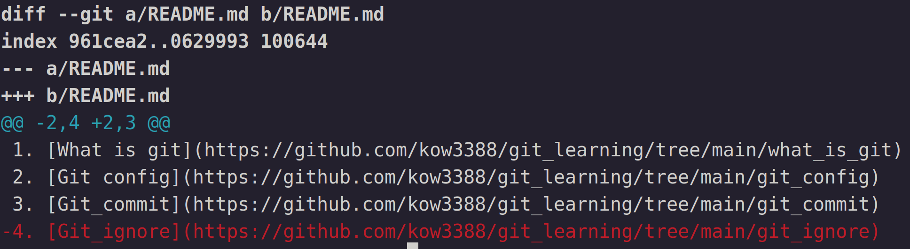

# Git difference
在開發中，我們經常需要知道哪些檔案做了哪些修改，git有提供完整的檔案比對方式，可以讓我們比對不同版本的檔案，不論是在資料夾中，或是index裡頭，甚至是reprository，都可以互相比對

## 修改比對編輯器(diff tool)
### Diff tool
在介紹如何比對檔案之前，先來介紹一下如何修改比對編輯器

假設我們使用git預設設的diff，畫面如下
<figure>
	
	<figcaption style="text-align: center;">Fig. 1: git diff</figcaption>
</figure>
使用git預設的diff其實蠻不直觀的

因此我建議可以更改diff tool來讓檔案比對更加清楚，要更改diff tool就要用到之前介紹的git config

指令如下，這邊以vim來作為新的diff tool當範例
```
git config --global diff.tool vimdiff
git config --global difftool.prompt false
git config --global alias.[指令別名] difftool
```
這邊一一介紹每一行的指令
1. 第一行的指令是將diff tool更改為vim
2. 第二行是取消開啟difftool時的詢問提示
3. 第三行是為difftool取別名

後面會說明如何比較

更改完後結果如下
<figure>
	
	<figcaption style="text-align: center;">Fig. 2: diff tool</figcaption>
</figure>
因此強烈推薦大家更改diff tool

### Editor
這邊順便介紹如何更改git的預設editor，在之後遇到需要一些情況時會用的更順手

這邊同樣以vim為範例
```
git config --global core.editor "vim"
```

## Git diif
git提供兩大類的指令來幫助使用者去查看檔案差異，分別是 "git diff" 和 "git difftool"

### git diff
我們先看如何使用預設的git diff，參考Fig. 1 可以看到以下資訊

1. 第一行表示我們比較了那兩個檔案
2. 第二行的index表示標頭資訊(header line)，這個是git的內部資訊
3. 第三行的 "--- a/README.md" 表示比較就的版本
4. 第四行的 "+++ b/README.md" 表示比較新的版本
5. 第五行的 "@@ -2,4 +2,3 @@" -表示舊版本，+表示新版本，"-2,4"表示從舊版檔案的第二行開始顯示4行，"+2,3"表示從新版本的第二行開始顯示三行，所以可以看到第四行紅字的部份是新版比舊版多的

### git difftool
diff tool的使用方法和diff其實完全一樣，只是顯示工具不同而已

### 圖解
由於diff和diff tool是可以比較working space, index和reprository的，因此有各種對應的situation，如果一一說明有點繁瑣，因此這邊以下圖Fig 3.表示各種情況(皆以difftool為範例，可以自行將其替換成diff)
<figure>
	
	<figcaption style="text-align: center;">Fig. 3: diff graph</figcaption>
</figure>
