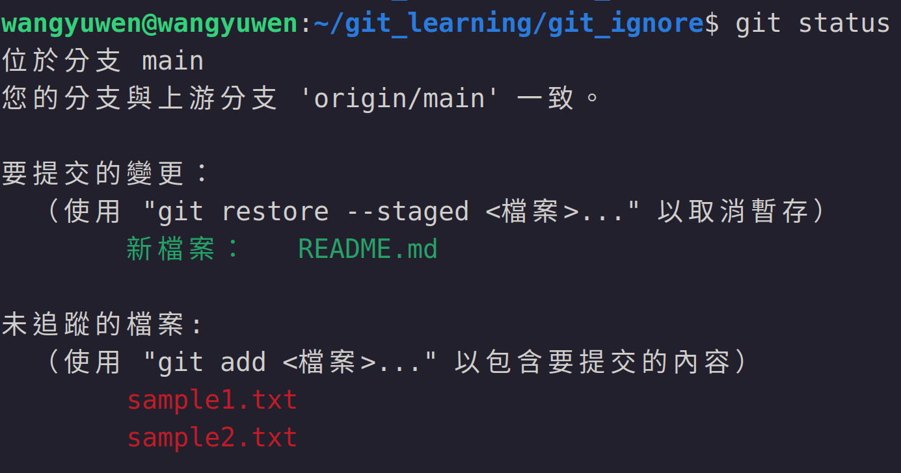

# Git ignore
在前面的章節，我們了解了 "git add" 和 "git commit" 的指令幫助我們將檔案放入index並推上repository

但實際上有一些檔案我們並不需要去在乎更新與否，這些檔案對我們的版本並不存在影響，例如: data

因此git提供了一個機制來忽略這些我們不在乎的檔案

## .gitignore
git內建忽略檔案的機制就是透過 ".gitignore" 這個檔案，git會去查看此檔案的內容，若檔案名稱在 ".gitignore" 中，則此檔案會被設為 "ignore" state，git就不會去追蹤此檔案是否更動

我們現在創建兩個txt檔，分別是sample1.txt和sample2.txt，用 "git status" 確認狀態

可以看到在還沒有 ".gitignore" 檔案之前，兩個檔案都是untracked的狀態，如下圖

這時我們創建一個 ".gitignore" 的檔案並在此檔案內寫入sample2.txt，如下圖

這時我們執行 "git add ." 和 "git status" ，可以發現只有sample1.txt被add，而sample2.txt被忽略，如下圖

\* ".gitignore" 前面的 "." 是指說此檔案是隱藏狀態，預設是無法看到的
