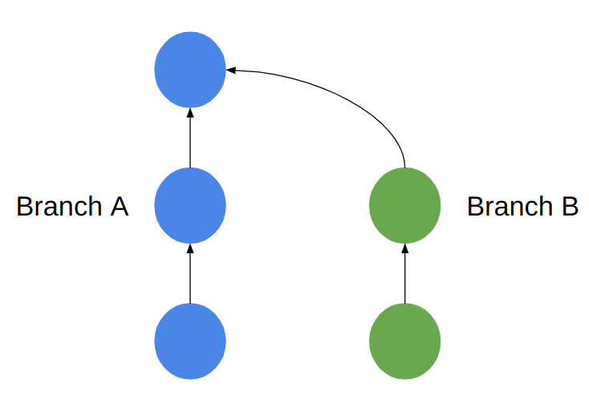
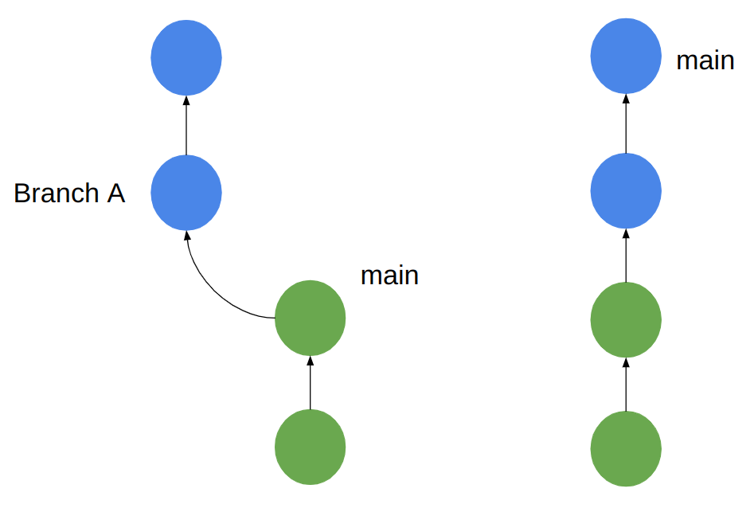
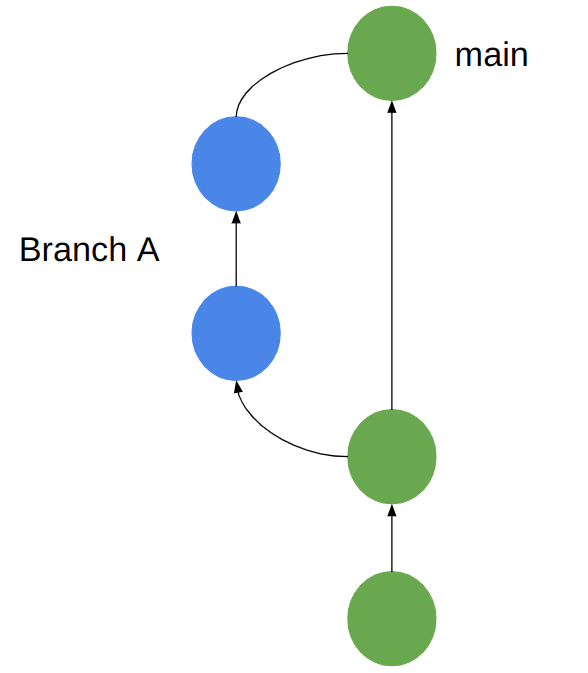
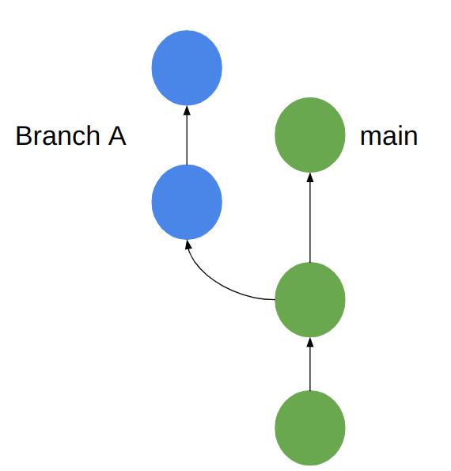
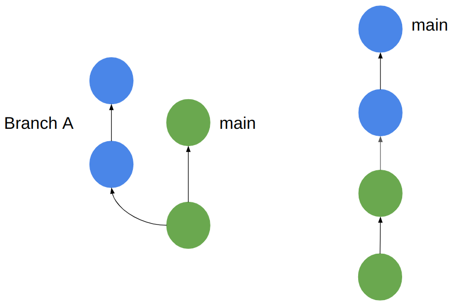
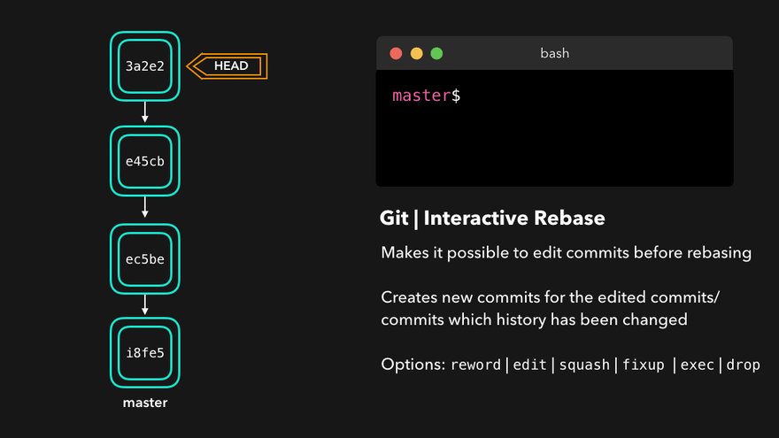

# 合併branch
在上一章節我們提到去創建branch來避免目前開發中的程式影響到穩定版本(main branch)，也有稍微提到如果我們已經開發完成後，會需要將現在這個branch合併至main當中，這一章節就是要來說明如何將branch合併

主要透過下面兩種指令來完成合併的功能
```
git merge
git rebase
```

## git merge
先從 "git merge" 開始介紹，假設我們現在處在branch A，我們下了以下指令
```
git merge B
```
這個意思是將branch B merge進branch A，可以看以下示意圖


但實際上如果直接下 "git merge" 指令，並不會得到上圖的結果，原因是 "git merge" 預設是用fast-forward merge(ff)

因此這邊比較一下fast-forward merge和non-fast-forward merge

### ff vs no-ff
#### ff
"git branch" 預設是ff
ff會把要merge的branch上更動的檔案完全的套用到令一個branch上(拉成一直線)如下圖


用ff有一個特點，那就是不會新增commit，會把branch的commit往前放

#### no-ff
no-ff又稱3-way merge

要使用no-ff要加上以下參數
```
git merge --no-ff branch名稱
```
使用no-ff的話就會在commit graph上保留branch的紀錄，並創建一個新的commit來紀錄兩個branch merge的結果

結果圖會長的如下圖(會長出小耳朵)


ff和no-ff的使用時機不同，由於no-ff會保留小耳朵，當有很多小耳朵的時候會顯的graph很亂，因此通常在比較重要的版本開發會使用no-ff，而例如說fix little bug這些小事就會使用ff

### 如果要合到的branch有被更動的話
有一種狀況是我們在branch開發時，有可能要合到的branch也有被更動，如下圖


這種情況下就無法使用ff的方式來merge，必定得使用no-ff的方式merge

不過git其實很聰明，它會自動判斷是否能使用ff，若不能使用它會自動轉換成no-ff

雖然在上面情況下git會知道要改用no-ff來合併，但有可能兩個branch會更改到相同的檔案，這個時候就是大家常說的衝突(conflict)，這個在後面章節會說明要如何解決conflict

## git rebase
在開始說明rebase前要記住，不要對已經push到remote repository的commit進行rebase，這個行為很危險
### git rebase "merge 功能"
"git rebase" 的指令如下
```
git rebase branch名稱
```
git rebase和ff其實有一點像，但還是有些微的差別，在上面merge時我們有說，如果要合到的branch有被更動的話，是無法使用ff的方式merge

Rebase顧名思義就是更改基底，因此即使要合到的branch有更動的話，還是可以將更動過得branch當作新的基底，並將branch的commit接在後面(移花接木最適合用來形容rebase)

rebase(移花接木)下以下指令後會得到結果如下圖
```
git rebase main
```


### git rebase "修改commit紀錄功能"
"git rebase" 除了有merge的功能外，它還由修該歷史紀錄的功能，指令如下
```
git rebase -i commit
```
git rebase interactive(-i)示意圖如下


[圖片來源: CS Visualize](https://dev.to/lydiahallie/cs-visualized-useful-git-commands-37p1#merge)

Rebase的interactive動作有以下幾種:
1. pick: 保留這個commit，不做任何改變
2. reword: 保留這個commit，但編輯commit訊息
3. edit: 保留此提交，但會對檔案做一些修改(例如:在code新增註解之類的)
4. squash: 將前面的commit合併到此commit，並修改訊息
5. fixup: 和squash很像，差別在於fixup的commit訊息會被之前的commit訊息覆蓋
6. drop: 移除此commit

實際上還有其他interactive動作，但rebase的interactive功能我並沒有到很熟練，因此這部份僅供參考，如果有誤請見諒
