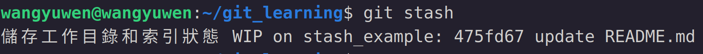
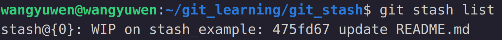
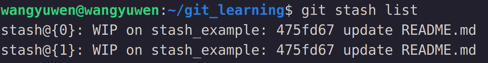
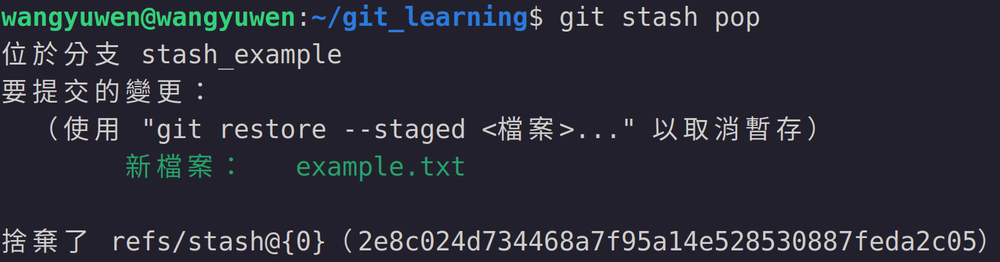
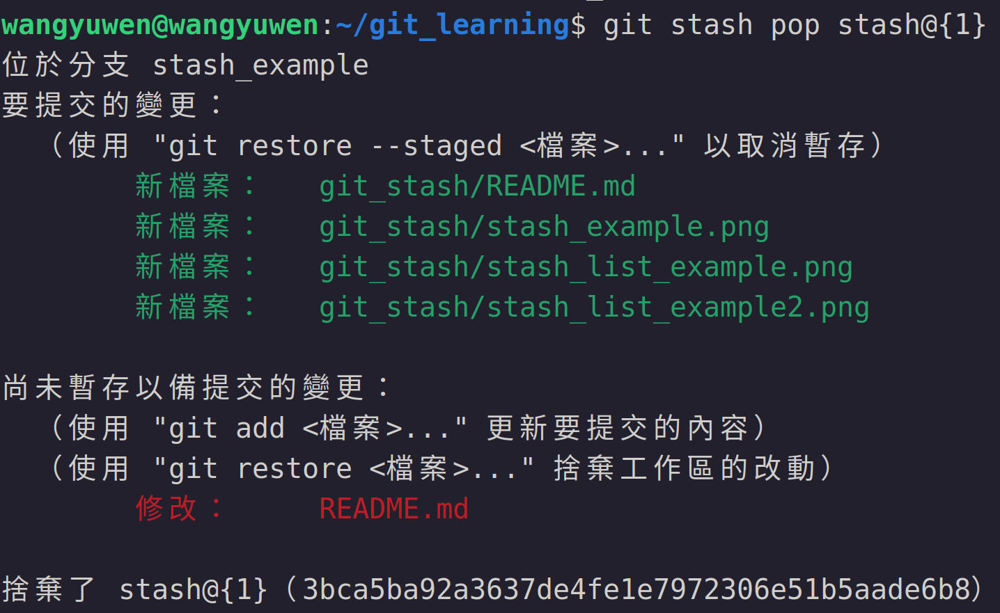

# Git 暫存
我們有可能在開發一個專案時，突然被老闆叫去修bug，這時我們可以用到之前學到的commit先提交，後續在把它reset，但其實我們還有一個作法，那就是把檔案暫存，也就是 "git stash"

## git stash
### 暫存
要暫存檔案的指令很簡單，指令如下
```
git stash
```
下此指令之後，會將當前目錄的內容暫存，結果如下


可以看到，我修改了 "git_learning/README.md" 這個檔案將其暫存起來

其中WIP是work in progress的縮寫，說明目前的工作是在 "stash_example" 這個branch上

而後面的 "475fd67 update README.md" 則是此專案目前最新的commit資訊

\* 這邊要注意git stash只對有被git追蹤的檔案有用，如果有新的檔案則要先 "git add" 後 "git stash" 才有效

### 瀏覽暫存列表
我們可以透過以下指令來查看目前我們暫存了哪些東西
```
git stash list
```
執行結果如下圖


其中前面的 "stash@{0}" 表示目前我們暫存了幾筆，如果有多筆則結果如下


\* "stash@{0}" 永遠是最新的那個，是一個stack結構

### 取出暫存結果
要取出暫存結果有兩種方式，分別是 "git stash pop" 和 "git stash apply"

#### git stash pop
先從pop開始介紹，pop是會將暫存結果取出，並把暫存結果從stack中移除，指令如下
```
git stash pop
```
這邊先講一下我的 "stash@{0}" 和 "stash@{1}" 分別暫存了什麼

stash@{0} 我新增了一個example.txt的file

stash@{1} 是我目前正在撰寫的 "git stash" 內容

當我下了上面的指令後，結果如下


可以看到example.txt被取出來了，並且此stash@{0}會被移除

當然我們也可以指定要pop特定的暫存結果，指令如下
```
git stash pop stash@{num}
```
這邊我將stash@{1}的結果拿出來，結果如下


### git stash apply
接著介紹apply，apply和pop最大的差別是pop會將暫存從stack中移除，而apply則是會將暫存結果保留在stack中

指令如下
```
git stash apply
git stash apply stash@{num}
```
基本上用法是和pop一模一樣的

## 清除暫存
清除暫存有分兩種，一種是一個一個清除，一種是全部清除

### git stash drop
先說明一個一個清除的方法，也就是drop，指令如下
```
git stash drop
```
這個指令會將最新的暫存結果清除，當然也可以指令要清除那一個暫存結果

指令如下
```
git stash drop stash@{num}
```

### git stash clear
git當然也提供一次全部清除，也就是clear

指令如下
```
git stash clear
```
下了此指令後，git會將在stack中的暫存結果全部清除
