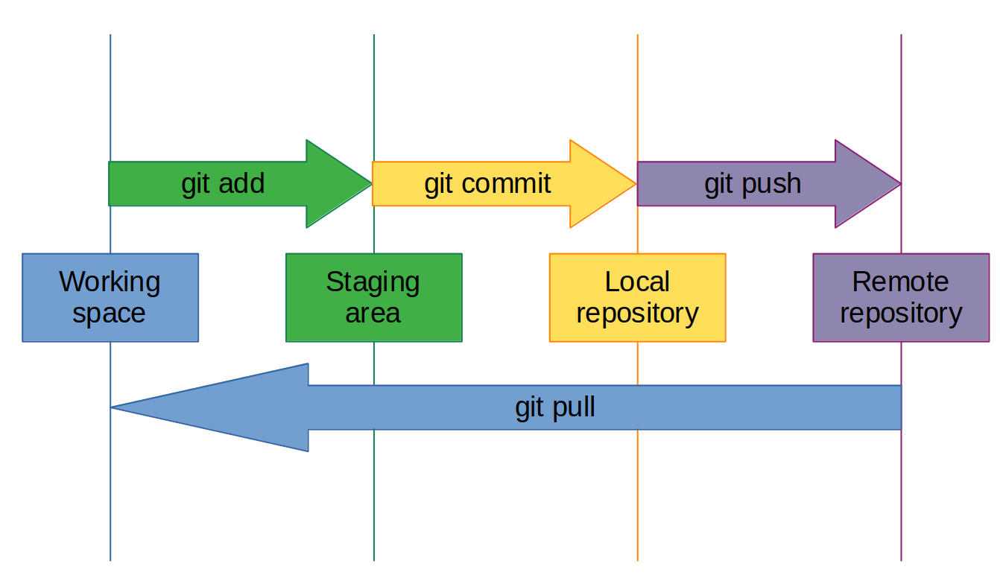
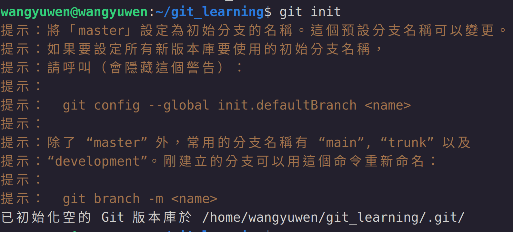
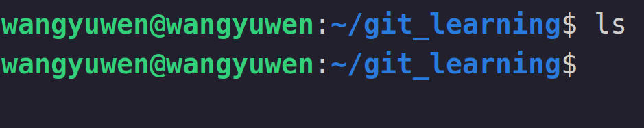
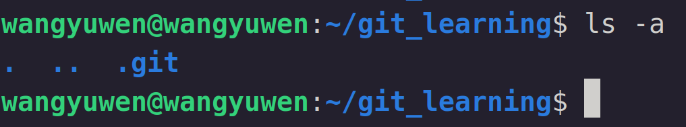
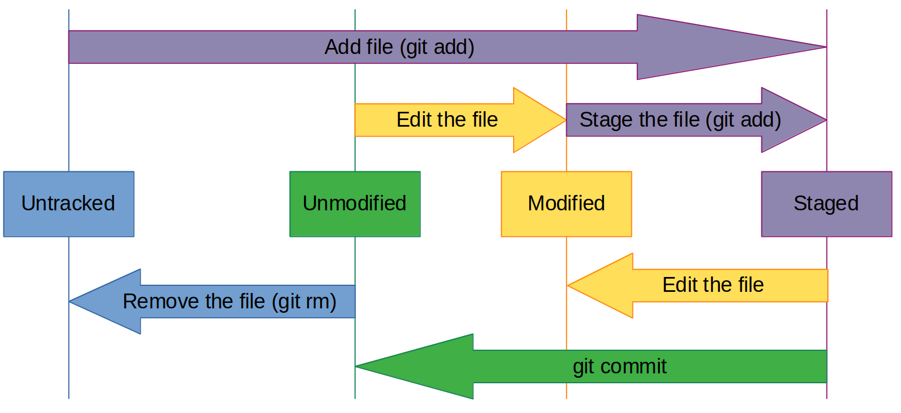

# What is Git
Git是一種分散式的VCS (Version Control System)
集中式 v.s. 分散式
集中式: 統一由一台server進行管理和維護(ex: SVN)
分散式: 由本地端和遠端同時進行維護，當某一端進行修改，修改完成後兩邊進行同步(ex: Git)

## Git v.s. Github (Gitlab, ...)
git是VCS，一個系統，而Github (Gitlab, ...)是一個遠端儲存空間remote repository(可以把他想成是google drive用於備份)

## Git install
每個版本有對應的下載安裝方式，這裡以linux為例
```
apt-get intall git
```

安裝完成後要先去完成設定檔，設定使用者名稱及信箱(指令如下)
```
git config --global user.name "使用者名稱"
git config --global user.email "使用者信箱"
```

config的用意可以知道修改文件的人是誰，在多人協作時才知道誰出包(?

後續章節會對config更加詳細介紹

## Git 工作流程
後面會對指令有更詳細的介紹，這邊先簡單介紹運作流程

可以搭配此圖片更加了解運作流程



1. 在目前的工作目錄夾(working space)下創一個.git的目錄夾(指令如下)
   ```
   git init
   ```
   

   這個 ".git" 的資料夾就是repository(檔案庫)，預設是看不到的，此資料夾內紀錄著此working space內所有的歷史紀錄，以此達到VC的效果
   
   用ls指令查看
   
   沒有任何檔案
   用ls -a查看
   


2. 將目前修改的文件存入暫存區(staging area)，文建會變更為staged狀態(本章後面會介紹檔案的各個狀態) (指令如下)
   ```
   git add .
   ```
   staging area可以想像成完成了工作先放置在旁邊還沒有放進檔案庫
   
   通常將檔案置入staging area就是準備要提交了，暫時不會更動

3. 將暫存區的檔案存入local repository(本地檔案庫) (指令如下)
   ```
   git commit -m "本次操作說明"
   ```
   此動作可以想成把把以完成放置在旁邊的工作放到書櫃裡

4. 將local repository的內容同步至remote repository(遠端檔案庫) (指令如下)
   ```
   git push origin main
   ```
   將目前本地端的結果推到遠端已達到同步的效果
   **(之後的章節會對origin和main做說明)**
   可以想像是自己書櫃裡的文件掃描之後上傳至google drive備份

5. 將remote repository的內容同步至local repository (指令如下)
   ```
   git pull origin main
   ```
   有時一個文件不一定是一個人所持有或開發，如果有人對遠端的文件進行修改，此時本地和遠端的內容會不同步，因此用此指令來同步本地端

   可以想像是有人對google drive內的文件改寫，將其載下來列印出來並放在桌上準備工作

## Git 檔案狀態
Git會將在working space的檔案分成幾種狀態，以此進行維護以及追蹤檔案的狀況

可以搭配此圖片更加了解



1. Untracked (未追蹤):
   Git尚未將此檔案進行版本管理
   
3. Unmodified (未更動):
   Git有對此檔案進行版本管理且此檔案和前一個版本相比未進行修改
   
5. Modified (更動):
   Git有對此檔案進行版本管理且此檔案和前一個版本相比有進行修改
   
7. Staged (暫存):
   將檔案進行暫存
